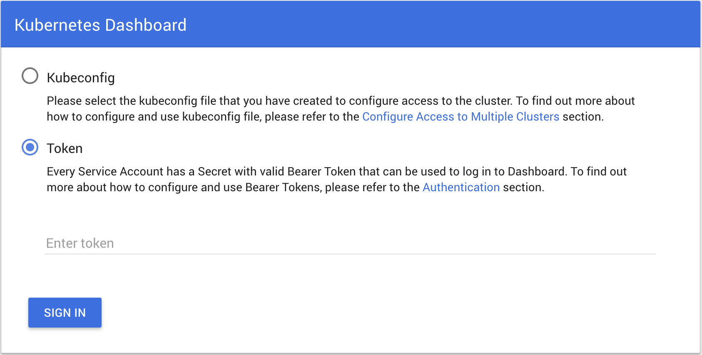

# Mojaloop Deployment

The document is intended for an audience with a stable technical knowledge that would like to setup an environment for development, testing and contributing to the Mojaloop project.

## Deployment and Setup

- [Pre-requisites](#1-pre-requisites)
- [Kubernetes](#3-kubernetes)
  - [Kubernetes Dashboard](#31-kubernetes-dashboard)
- [Helm](#4-helm)
  - [Helm configuration](#41-helm-configuration)
- [Postman](#5-postman)
  - [Installing Postman](#51-installing-postman)
  - [Setup Postman](#52-setup-postman)
  
### 1. Pre-requisites

A list of the pre-requisite tool set required for the deployment of Mojaloop;
- **Kubernetes** An open-source system for automating deployment, scaling, and management of containerized applications. Find out more about [Kubernetes](https://kubernetes.io),
  - kubectl - Kubernetes CLI for Kubernetes Management is required. Find out more about [kubectl](https://kubernetes.io/docs/reference/kubectl/overview/),
    - [Install-kubectl](https://kubernetes.io/docs/tasks/tools/install-kubectl/),
  - microk8s - MicroK8s installs a barebones upstream Kubernetes for a single node deployment generally used for local development. We recommend this installation on Linux (ubuntu) OS. Find out more about [microk8s](https://microk8s.io/) and [microk8s documents](https://microk8s.io/docs/),
    - [Install-microk8s](https://microk8s.io/docs/),
  - kubectx - Not required but useful. Find out more about [kubectx](https://github.com/ahmetb/kubectx),
  - kubetail - Not required but useful. Bash script that enables you to aggregate (tail/follow) logs from multiple pods into one stream. Find out more about [kubetail](https://github.com/johanhaleby/kubetail),
- **Docker** Provides containerized environment to host the application. Find out more about [Docker](https://docker.com),
- **Helm** A package manager for Kubernetes. Find out more about [Helm](https://helm.sh),
- **Postman** Postman is a Google Chrome application for the interacting with HTTP API's. It presents you with a friendly GUI for the construction requests and reading responces.	https://www.getpostman.com/apps. Find out more about [Postman](https://postman.com).

For **local guides** on how to setup the pre-requisites on your laptop or desktop, refer to the appropriate link document below;
- [Local Setup for Mac](local-setup-mac.md)
- [Local Setup for Linux](local-setup-linux.md)
- [Local Setup for Windows](local-setup-windows.md)

### 2. Deployment Recommendations

This provides environment resource recommendations with a view of the infrastructure architecture.

**Resources Requirements:**

* Control Plane (i.e. Master Node)
  
  [https://kubernetes.io/docs/setup/cluster-large/#size-of-master-and-master-components](https://kubernetes.io/docs/setup/cluster-large/#size-of-master-and-master-components)

  * 3x Master Nodes for future node scaling and HA (High Availability)

* ETCd Plane:

  [https://coreos.com/etcd/docs/latest/op-guide/hardware.html](https://coreos.com/etcd/docs/latest/op-guide/hardware.html)

  * 3x ETCd nodes for HA (High Availability)

* Compute Plane (i.e. Worker Node):

  TBC once load testing has been concluded. However the current general recommended size:

  * 3x Worker nodes, each being:
    * 4x vCPUs, 16GB of RAM, and 40gb storage

  **Note** that this would also depend on your underlying infrastructure, and it does NOT include requirements for persistent volumes/storage.


### 3. Kubernetes

This section will guide the reader through the deployment process to setup Kubernetes.

If you are new to Kubernetes it is strongly recommended to familiarize yourself with Kubernetes. [Kubernetes Concepts](https://kubernetes.io/docs/concepts/overview/) is a good place to start and will provide an overview.

The following are Kubernetes concepts used within the project. An understanding of these concepts is imperative before attempting the deployment;

* Deployment
* Pod
* ReplicaSets
* Service
* Ingress
* StatefulSet
* DaemonSet
* Ingress Controller
* ConfigMap
* Secret

Insure **kubectl** is installed. A complete set of installation instruction are available [here](https://kubernetes.io/docs/tasks/tools/install-kubectl/)

#### 3.1 Kubernetes Dashboard:

1. Kubernetes Dashboard roles, services & deployment.

   Install for Dashboard using Helm (not needed if **MicroK8s** is installed): [kubernetes-dashboard](https://github.com/helm/charts/tree/master/stable/kubernetes-dashboard)

   **IMPORTANT:** Always verify the current [kubernetes-dashboard](https://github.com/kubernetes/dashboard) yaml file is still correct as used in the below command.
   ```bash
   kubectl create -f https://raw.githubusercontent.com/kubernetes/dashboard/v1.10.1/src/deploy/recommended/kubernetes-dashboard.yaml
   ```
   
   If you have installed MicroK8s, **enable the MicroK8s** dashboard;
   ```bash
   microk8s.enable dashboard
   ```
   **Remember** to prefix all **kubectl** commands with **microk8s** if you opted not to create an alias.

2. Verify Kubernetes Dashboard;
   ```bash
   kubectl get pod --namespace=kube-system |grep dashboard
   ```

3. Start proxy for local UI in new terminal;
   ```bash
   kubectl proxy ui
   ```

4. Open URI in default browser:
    
   ```
   http://localhost.com:8001/api/v1/namespaces/kube-system/services/https:kubernetes-dashboard:/proxy/#!
   ```

   Select **Token**. Generate a token to use there by:
   
   ```bash
   kubectl -n kube-system get secrets | grep dashboard-token
   ```

   The token to use is shown on the last line of the output of that command;
   
   ```bash
   kubectl -n kube-system describe secrets/kubernetes-dashboard-token-btbwf
   ```

   The **{kubernetes-dashboard-token-btbwf}** is retrieved from the output in the previous step. For more information on generating the token, follow the **Authentication** link in the window.



### 4. Helm 

Please review [Mojaloop Helm Chart](../repositories/helm.md) to understand the relationships between the deployed Mojaloop helm charts.

#### 4.1 Helm configuration

1. Config Helm CLI and install Helm Tiller on K8s cluster:
   ```bash
   helm init
   ```

2. Validate Helm Tiller is up and running:
   ```bash
   kubectl -n kube-system get po | grep tiller
   ```

3. Add mojaloop repo to your Helm config (optional). Linux use with sudo:
   ```bash
   helm repo add mojaloop http://mojaloop.io/helm/repo/
   ```
   If the repo already exists, substitute 'add' with 'apply' in the above command.

4. Add the additional dependency Helm repositories. This is needed to resolve Helm Chart dependencies required by Mojaloop charts. Linux use with sudo;
   ```bash
   helm repo add incubator http://storage.googleapis.com/kubernetes-charts-incubator
   helm repo add kiwigrid https://kiwigrid.github.io
   ```

5. Update helm repositories. Linux use with sudo:
   ```bash
   helm repo update
   ```

6. Install nginx-ingress for load balancing & external access. Linux use with sudo:
   ```bash
   helm --namespace kube-public install stable/nginx-ingress
   ```
   
7. Install Mojaloop. Linux use with sudo:

   Default installation:
   ```bash
   helm --namespace demo --name moja install mojaloop/mojaloop
   ```
   
   Version specific installation:
   ```bash
   helm --namespace demo --name moja install mojaloop/mojaloop -version {version}
   ```
   
   List of available versions:
   ```bash
   helm search -l mojaloop/mojaloop
   ```
   
   Custom configured installation:
   ```bash
   helm --namespace demo --name moja install mojaloop/mojaloop -file {custom-values.yaml}
   ```
   _Note: Download and customize the [https://github.com/mojaloop/helm/blob/master/mojaloop/values.yaml](https://github.com/mojaloop/helm/blob/master/mojaloop/values.yaml). Note that you should use the value file from the specific version that you will be installing._

7. Update your /ect/hosts for local deployment:

   _Note: This is only applicable for local deployments_
   ```bash
   vi /etc/hosts
   ```
   
   Include the following line to the config;
   ```text
   127.0.0.1       interop-switch.local central-kms.local forensic-logging-sidecar.local central-ledger.local central-end-user-registry.local central-directory.local central-hub.local central-settlements.local ml-api-adapter.local
   ```

8. Test system health in your browser after installation. This will only work if you have an active helm chart deployment running.
   
   _Note: This is only applicable for local deployments_
   
   **ml-api-adapter** health test:
   ```
   http://ml-api-adapter.local/health
   ```

   **central-ledger** health test:
   ```
   http://central-ledger.local/health
   ```

### 5. Postman

Postman is used to send requests and receive responses.

#### 5.1 Installing Postman

Please, follow these instructions: [Get Postman](https://www.getpostman.com/postman)

#### 5.2 Setup Postman

##### Import the Collection
1. Open **Postman**
2. Click **Import** and then **Import From Link**
3. Paste the following link [https://raw.githubusercontent.com/mojaloop/postman/master/Mojaloop.postman_collection.json](https://raw.githubusercontent.com/mojaloop/postman/master/Mojaloop.postman_collection.json) in the input box.
4. Press the **Import** button to continue.

##### Setup the Environment Configurations
1. You'll now need to import environment variables. For local testing, download this file [https://raw.githubusercontent.com/mojaloop/postman/master/environments/MojaloopLocal.postman_environment.json](https://raw.githubusercontent.com/mojaloop/postman/master/environments/MojaloopLocal.postman_environment.json)
2. Click **Import** and then **Import File**
3. Select the _MojaloopLocal.postman_environment.json_ file you downloaded
4. In the imported collection, navigate to the _central_ledger_ directory  
