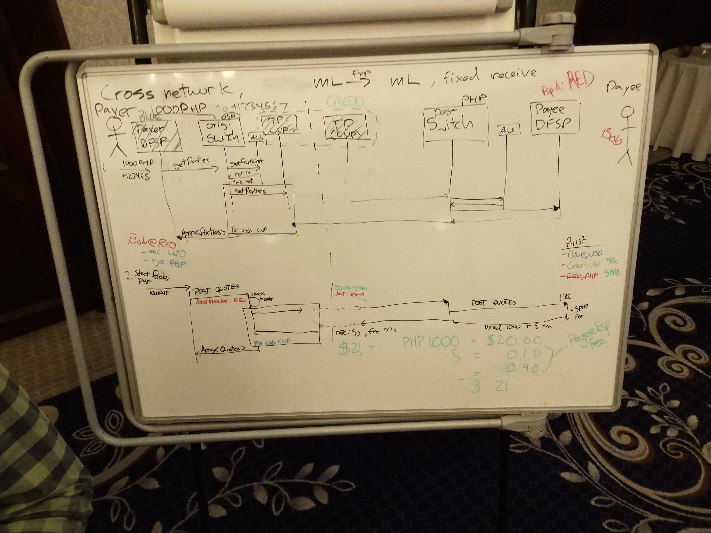

# Cross Border Discussion Day 2

>**Links**
>- [Day 1 Notes](./cross_border_day_1.md)
>- [Relevant Issue on DA Board](https://github.com/mojaloop/design-authority/issues/32)
>- [Mojaloop Spec Pull Request](https://github.com/mojaloop/mojaloop-specification/pull/22)

## Next Steps:

- Updated the proposal APIs
- Present the consolidated change to the CCB in writing
- Couple of weeks to put together the changes (Michael/Adrian to split up the work)
- Mid-November CCB call
 

## Session 1

Unanswered Questions:
- addressing
  - break it down?
  - cross-mojaloop
  - what does a PayerFSP do with an address?

- ALS + routing
  - what optimizations does the API need to do/allow?

- local vs. remote DFSP ids

- Downstream failures
  - When paymnet does clear, does the payer receive a notification (esp. with 'delayed' payments that may interface with non-mojaloop systems)
  - Can a CNP send a `PATCH` of the tx to update the Payee somehow?

---

- multiple quotes and route responses:
  - how do display to the user?
  - We need to establish rules for filtering routes
    - hard to do: e.g. blacklisting a switch? or express a preference for certain routes

- how will Sender DFSP discover the scheme rules for a receiver?
- does the Sender DFSP need to 'know' the final switch? Or can it just 'know' the next one?

---

Running up against ML + non-ML assumptions
- does this mean CNP needs to do more work when connecting to non-ML?
  - e.g. knowing the resulting scheme/switch?
    - why? Failure handling
    - based on yesterday's decision: Should the CNP do the work here?

- Take a lesson from SWIFT:
  - bank doesn't know where the money is going
  - can we avoid this in ML?

---

CNP: Goal is to 'act like' a normal member of the network
  - This minimizes the responsibilities that the scheme assumes

When is the TX considered completed?
  - There might be cases where the scheme considers it done, but it is not techincally finished end to end

How do we deal with service deteroriation?
  - Scheme rules

---

Back to quotes:

- how to express quote information?
  - are quotes and routes separate? Presumably, yes

- The quote is the most expensive step
  - Can we provide QOS information here as part of the lookup?

Addressing:
- Need for a globally unique address
  - Allow an address space for DFSPs and unique persons/accounts
- sheme says "this isn't in my space"
- CNP figures out the routes to get to that space

---

### Michael's Tangent:

- did we make the wrong assumptions about the CNP?

**switch:** Knows CNPs + FXPs
**CNPs:** holds routing table and lookup

- if the sender or receiver is an FXP, the the tx is *not* a cross-currency tx

--- 

## Session 2

*Decision:*
- header value is CNP id
- partId object is the final FSP

valueDate
- implied that funds are expected to clear before the valueDate
- can still have short expiry times on tx

- CNP:
  - returns an obfuscated set of fees
  - fits into our current model

- condition:
  - existing object cryptographically tied to the tx object
    - but for multi-hop, we don't only know this
    - fixed receive makes this tricker (which is what echo data hopes to solve)

  - We want **only 1 condition for all hops**
  - the idea of a multi-condition is a "perversion" (according to some)

## Boards:

_board 3: Cross Network lookup and quotes flow, fixed receive of 1000 PHP from USD_

