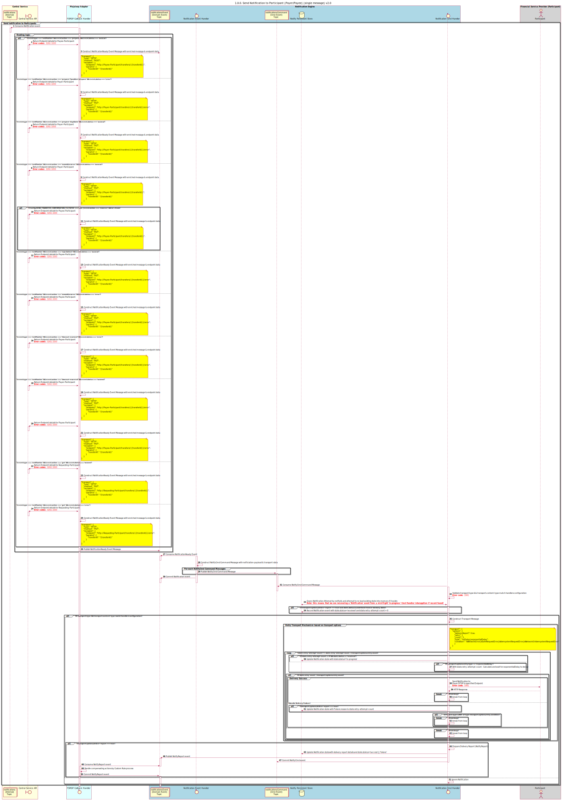

# Notifications

This document will discuss the architecture and design of Mojaloop's Notification-engine.

## 1. Requirements

```
1.1. Notification-engine must be stateless
    a. Notification messages consumed by the Notification-engine contains everything needed to send notifications

1.2. Notification messages must support
    a. Config included to indicate that the message must be reliably delivered
    b. Notification transport (i.e. HTTP, gRPC, Email, etc)
    c. End-point details to deliver the notification

1.3. Reliability
    a. Notification-engine must support retries based on a configuration
    b. HTTP keep-alive must be configured for HTTP transports
    c. A delivery-report must be published to a kafka event topic indicating the result of the notification:
        i. success / error
        ii. meta-data: request-timestamp, delivery-timestamp, request-latency
    d. Delivery-reports events must be persisted into a data-store
    
1.4. Notification-engine must be support the following ingress:
    a. Consuming event messages from a Kafka topic
        i. Notification message JSON schema
    b. An API for sending notifications
        ii. OpenAPI v3 YAML specification document
```


## 2. Design

### 2.1 Overview

This design proposes the seperation of the current Notification capabilities (transport vs mojaloop-contextual processing) into the following components:

| Components | Description | APIs | Notes |
| --- | --- | --- | --- |
| Notification Evt Handler | Consumes existing Notification events, then interprates (in context of Mojaloop use-cases) those events into an appropriate NotifyCmd message to some explicit receipient. This component is stateful, and will store information of the notification events and delivery reports as required. | API operations to query stored deliveryReports | This component is a "Central-Service" |
| Notification Cmd Handler | This is responsible for the "notification-engine" capabilities. This will consume and process Notification Command message produced by the NotificationEvt Handler. This component is stateless, and has no dependency on any persistence or caching stores. This allows for multiple pluggable Cmd Handlers to exist to handle different transports as required. This component will also manage message and transport security aspects such as TLS (Transport Layer Security) and JWS Signing for HTTP transports. | API operations to send notifications synchronously | This component is a "Supporting-Service" |


...

<!--

-->

### 2.2. Sequence Diagram



### 2.3 Types of Notifications

| Event | Description | Notes |
| --- | --- | --- |
| Notification | Existing Notification event currently produced by Central-Service components which is the result of some Mojaloop use-case. |  |
| NotifyCmd | Notification Command message produced by the Notification Evt Handler, which is consumed and processed by the Notification Cmd Handler. This message is generic, and can be used for any notification purposes. It is not context aware, nor does it have any knowledge of a Mojaloop use-case. It contains only the transport specific information requires to delivery the notification. |  |
| NotifyDelivered | Domain event message to broadcast Delivery reports to Central-Services. This event can be consumed by the Central-Services (currently the Notification Evt Handler) to persist this information to a store. |  |

## 3. Models

#### 3.2.1. Events

#### 3.2.1.a. Notification event produced by Central-Services (Existing)
##### 3.2.1.a.ii. Examples

```JSON
{
    "from": "payerfsp",
    "to": "payeefsp",
    "id": "aa398930-f210-4dcd-8af0-7c769cea1660",
    "content": {
      "headers": {
          "content-type": "application/vnd.interoperability.transfers+json;version=1.0",
          "date": "2019-05-28T16:34:41.000Z",
          "fspiop-source": "payerfsp",
          "fspiop-destination": "payeefsp"
      },
      "payload": "data:application/vnd.interoperability.transfers+json;version=1.0;base64,ewogICJmdWxmaWxtZW50IjogIlVObEo5OGhaVFlfZHN3MGNBcXc0aV9VTjN2NHV0dDdDWkZCNHlmTGJWRkEiLAogICJjb21wbGV0ZWRUaW1lc3RhbXAiOiAiMjAxOS0wNS0yOVQyMzoxODozMi44NTZaIiwKICAidHJhbnNmZXJTdGF0ZSI6ICJDT01NSVRURUQiCn0"
    },
    "type": "application/json",
    "metadata": {
        "event": {
            "id": "3920382d-f78c-4023-adf9-0d7a4a2a3a2f",
            "type": "transfer",
            "action": "prepare",
            "createdAt": "2019-05-29T23:18:32.935Z",
            "state": {
                "status": "success",
                "code": 0,
                "description": "action successful"
            },
            "responseTo": "1a396c07-47ab-4d68-a7a0-7a1ea36f0012"
        },
        "trace": {
            "service": "central-ledger-prepare-handler",
            "traceId": "bbd7b2c7-3978-408e-ae2e-a13012c47739",
            "parentSpanId": "4e3ce424-d611-417b-a7b3-44ba9bbc5840",
            "spanId": "efeb5c22-689b-4d04-ac5a-2aa9cd0a7e87",
            "startTimestamp": "2015-08-29T11:22:09.815479Z",
            "finishTimestamp": "2015-08-29T11:22:09.815479Z",
            "tags": {
              "transctionId": "659ee338-c8f8-4c06-8aff-944e6c5cd694",
              "transctionType": "transfer",
              "parentEventType": "bulk-prepare",
              "parentEventAction": "prepare"
            }
        }
    }
}
```

#### 3.2.1.b. Notification Command produced by Notificant Evt Handler

##### 3.2.1.b.i. Schemas

[eventNotifyCmd.schema.json](assets/schemas/eventNotifyCmd.schema.json)

##### 3.2.1.b.ii. Examples

```JSON
{
    "msgId": "18efb9ea-d29a-42b9-9b30-59e1e7cfe216", // Generated by the NotificationEvtHandler
    "msgKey": "861b86e6-c3da-48b3-ba17-896710287d1f", // Mapped from the aggregateId, used by Kafka for Key-partitioning
    "msgName": "NotifyCmd",
    "msgType": "Command", // DomainEvents
    "msgTopic": "NotificationCommands", // Topic that the message will be published too
    "msgPartition": null, // Optional partition used for publishing the message to the msgTopic
    "msgTimestamp": 1607677081837, // Time of message creation
    "aggregateName": "Notifications",
    "aggregateId": "861b86e6-c3da-48b3-ba17-896710287d1f", // Generated by the NotificationEvtHandler
    "notifyId": "3920382d-f78c-4023-adf9-0d7a4a2a3a2f", // Mapped from the metadata.event.id by the NotificationEvtHandler, used to correlate multiple NotifyCmd.
    "transport": { // Transport information required by the notification-engine
      "type": "HTTP", // Transport type
      "method": "GET", // Optional method for the associated transport
      "contentType": "application/vnd.interoperability.paries+json;version=1.0",
      "recipient": {
        "endpoint": "http://fsp.com/parties/{{partyIdType}}/{{partyId}}}?key={{value}}", // Templated endpoint. It can be a hardcoded string with all parameters pre-rendered into the string.
        "params": { // Optional template parameters
          "partyIdType": "MSISDN",
          "partyId": "12345",
          "value": "ABCD"
        }
      },
      "options": { // Run-time config options for the notification-engine
        "deliveryReport": true, // Enable delivery-reporting
        "retry": { //Retry config
          "count": 3,
          "type": "noDelay|exponentialDelay", // ref for exponentialDelay: https://developers.google.com/analytics/devguides/reporting/core/v3/errors#backoff
          "condition": "isNetworkError|isIdempotentRequestError|isNetworkOrIdempotentRequestError" //  isNetworkOrIdempotentRequestError is default, it retries if it is a network error or (using HTTP as an example) 5xx error on an idempotent request (i.e GET, HEAD, OPTIONS, PUT or DELETE)
        }
      }
    },
    "payload": {
      // Headers to be send in request. Note trace-headers (traceParent, traceState) will also included when sending out the request when provided in traceInfo section.
      "headers": {
        "content-type": "application/vnd.interoperability.transfers+json;version=1.0",
        "date": "2019-05-28T16:34:41.000Z",
        "fspiop-source": "payerfsp",
        "fspiop-destination": "payerfsp"
      },
      // Body is optional and may be ignored depending on the transport.method
      "body": "data:application/vnd.interoperability.transfers+json;version=1.0;base64,ewogICJmdWxmaWxtZW50IjogIlVObEo5OGhaVFlfZHN3MGNBcXc0aV9VTjN2NHV0dDdDWkZCNHlmTGJWRkEiLAogICJjb21wbGV0ZWRUaW1lc3RhbXAiOiAiMjAxOS0wNS0yOVQyMzoxODozMi44NTZaIiwKICAidHJhbnNmZXJTdGF0ZSI6ICJDT01NSVRURUQiCn0"
    },
    "traceInfo": { // Optional. Populate if trace-headers are to be be included in request headers.
        "traceParent": "00-8e540e87060d56a2d2e0be5d732791e7-d96a5971b7c5cac6-21",
        "traceState": "acmevendor=eyJzcGFuSWQiOiJkOTZhNTk3MWI3YzVjYWM2IiwidGltZUFwaVByZXBhcmUiOiIxNjA3Njc3MDgxNzAwIiwidGltZUFwaUZ1bGZpbCI6IjE2MDc2NzcwODE4MTkifQ==",
        "service": "notification-evt-handler",
        "startTimestamp": 1607677081837,
        "finishTimestamp": 2007677081838
    }
}
```

#### 3.2.1.c. Delivery-report Event produced by Notification Cmd Handler
##### 3.2.1.c.i. Schemas
[notifyDelivered.schema.json](assets/schemas/notifyDelivered.schema.json)

##### 3.2.1.c.ii. Examples

```JSON
{
    "msgId": "18efb9ea-d29a-42b9-9b30-59e1e7cfe216", // Generated by the NotificationEvtHandler
    "msgKey": "861b86e6-c3da-48b3-ba17-896710287d1f", // Mapped from the aggregateId, used by Kafka for Key-partitioning
    "msgName": "NotifyDelivered",
    "msgType": "Domain", // DomainEvents
    "msgTopic": "NotificationCommands", // Topic that the message will be published too
    "msgPartition": null, // Optional partition used for publishing the message to the msgTopic
    "msgTimestamp": 2007677081820, // UTC Time of message creation
    "aggregateName": "Notifications",
    "aggregateId": "861b86e6-c3da-48b3-ba17-896710287d1f", // Generated by the NotificationEvtHandler
    "notifyId": "3920382d-f78c-4023-adf9-0d7a4a2a3a2f", // Mapped from the metadata.event.id by the NotificationEvtHandler, used to correlate multiple NotifyCmd.
    "report": { // Transport information required by the notification-engine
      "requestTimestamp": 1507677081120, // UTC Timestamp of when request was received
      "deliveryTimestamp": 1607677081840, // UTC Timestamp of delivery
      "deliveryReqLatency": 100, // Request latency of the successful delivery in milliseconds (optional)
      "retryAttempts": 1, // Number of retries that were necessary to delivery the message
      "response": {
        "statusCode": "202", // status code from transport
        "statusDescription": "Accepted",
        "headers": {
          "content-type": "application/vnd.interoperability.transfers+json;version=1.0",
          "date": "2019-05-28T16:34:41.000Z"
        },
        "body": "{}"
      },
      "accepted": true,
      "errorInformation": { // Only applicable if "accepted"=false, and expected to occur if we are not able to deliver the notification due to a transport issues: connectivity, timeout or certificate.
        "errorCode": "408", // Internal error code
        "errorDescription": "ECONNABORTED\ntimeout of 2ms exceeded\nError: timeout of 2ms exceeded\n    at createError (/node_modules/axios/lib/core/createError.js:16:15)\n    at Timeout.handleRequestTimeout (/node_modules/axios/lib/adapters/http.js:252:16)\n    at listOnTimeout (timers.js:324:15)\n    at processTimers (timers.js:268:5)" // Can include a stringified stack trace.
      }
    },
    "traceInfo": {
        "traceParent": "00-8e540e87060d56a2d2e0be5d732791e7-d96a5971b7c5cac6-21",
        "traceState": "acmevendor=eyJzcGFuSWQiOiJkOTZhNTk3MWI3YzVjYWM2IiwidGltZUFwaVByZXBhcmUiOiIxNjA3Njc3MDgxNzAwIiwidGltZUFwaUZ1bGZpbCI6IjE2MDc2NzcwODE4MTkifQ==",
        "service": "notification-Cmd-handler",
        "startTimestamp": 1607677081837,
        "finishTimestamp": 2007677081838
    }
}
```

## 4. Example Scenarios

### 4.1. Multiple Transports


The above scenario depicts two FSPs each utilsing two different transports for FSPIOP Transfer interactions:
- FSP1 (payer) is using HTTP transport
- FSP2 (payee) is using gRCP transport

Each of the FSPs in this example have had their associated callbacks registered which includes their transport preference (i.e. HTTP vs gRPC).

```http
POST /participants/FSP1/endpoints HTTP/1.1
Host: central-ledger-admin-api.mojaloop.live
Content-Type: application/json

{
  "type": "FSPIOP_CALLBACK_URL_TRANSFER_POST",
  "value": "http://fsp2.com/transfers"
}
```

```http
POST /participants/FSP2/endpoints HTTP/1.1
Host: central-ledger-admin-api.mojaloop.live
Content-Type: application/json

{
  "type": "FSPIOP_CALLBACK_URL_TRANSFER_PUT",
  "value": "grpc://fsp2.com/transfers"
}
```

With this design it is possible to achieve this by introducing two different ML-API-Adapters for each of the different Transports (i.e. HTTP, gRPC), and similiarly two different Notification Engines for each of these transports handling callbacks.

Each of the Notification Engines will only listen to event messages that match their intended transport types, and will thus discard non-applicable ones.

This therefore allows the Central-Ledger components to be isolated from the transport specific logic (and transformations if applicable) for notification callbacks.

The delivery-report for each of the POST/PUT interactions provides the assurance that the notifications results are recorded by the Central-Service Notification-Evt-Handler component. This component is able to raise alerts or alternatively handle any compensating actions independantly of the FSP's transport preferences.

#### 4.1.a. gRPC Transport example for a POST Transfer Callback Notification Messages for FSP1 to FSP2

NotifyCmd Command Event:
```JSON
{
    "msgId": "66a2ec9a-9d4f-4439-8d38-19c3aa21d54e",
    "msgKey": "861b86e6-c3da-48b3-ba17-896710287d1f",
    "msgName": "NotifyCmd",
    "msgType": "Command",
    "msgTopic": "NotificationCommands",
    "msgPartition": null,
    "msgTimestamp": 1607677081837,
    "aggregateName": "Notifications",
    "aggregateId": "861b86e6-c3da-48b3-ba17-896710287d1f",
    "notifyId": "b17b7125-a0fc-451f-98ee-7e4c870c7d13",
    "transport": {
      "type": "GRPC",
      "method": "POST",
      "contentType": "application/vnd.interoperability.transfers+json;version=1.0",
      "recipient": {
        "endpoint": "fsp2.com/transfers"
      },
      "options": {
        "deliveryReport": true,
        "retry": {
          "count": 3,
          "type": "exponentialDelay",
          "condition": "isNetworkOrIdempotentRequestError"
        }
      }
    },
    "payload": {
      "headers": {
        "content-type": "application/vnd.interoperability.transfers+json;version=1.0",
        "date": "2019-05-28T16:34:41.000Z",
        "fspiop-source": "FSP1",
        "fspiop-destination": "FSP2"
      },
      "body": "data:application/vnd.interoperability.transfers+json;version=1.0;base64,ENCODED-PREPARE-REQUEST"
    },
    "traceInfo": {
        "traceParent": "00-8e540e87060d56a2d2e0be5d732791e7-d96a5971b7c5cac6-21",
        "traceState": "acmevendor=eyJzcGFuSWQiOiJkOTZhNTk3MWI3YzVjYWM2IiwidGltZUFwaVByZXBhcmUiOiIxNjA3Njc3MDgxNzAwIiwidGltZUFwaUZ1bGZpbCI6IjE2MDc2NzcwODE4MTkifQ==",
        "service": "notification-evt-handler",
        "startTimestamp": 1607677081837,
        "finishTimestamp": 2007677081838
    }
}
```

NotifyDelivered Domain Event:
```JSON
{
    "msgId": "0ee9331a-1a71-4efc-a22d-868fcbf59658",
    "msgKey": "861b86e6-c3da-48b3-ba17-896710287d1f",
    "msgName": "NotifyDelivered",
    "msgType": "Domain",
    "msgTopic": "NotificationCommands",
    "msgPartition": null,
    "msgTimestamp": 2007677081820,
    "aggregateName": "Notifications",
    "aggregateId": "861b86e6-c3da-48b3-ba17-896710287d1f",
    "notifyId": "b17b7125-a0fc-451f-98ee-7e4c870c7d13",
    "report": {
      "requestTimestamp": 1507677081120,
      "deliveryTimestamp": 1607677081840,
      "deliveryReqLatency": 100,
      "retryAttempts": 0,
      "response": {
        "statusCode": "0",
        "statusDescription": "OK",
        "headers": {
          "content-type": "application/vnd.interoperability.transfers+json;version=1.0",
          "date": "2019-05-28T16:34:41.000Z"
        },
        "body": "{}",
      },
      "accepted": true
    },
    "traceInfo": {
        "traceParent": "00-8e540e87060d56a2d2e0be5d732791e7-d96a5971b7c5cac6-21",
        "traceState": "acmevendor=eyJzcGFuSWQiOiJkOTZhNTk3MWI3YzVjYWM2IiwidGltZUFwaVByZXBhcmUiOiIxNjA3Njc3MDgxNzAwIiwidGltZUFwaUZ1bGZpbCI6IjE2MDc2NzcwODE4MTkifQ==",
        "service": "notification-Cmd-handler",
        "startTimestamp": 1607677081837,
        "finishTimestamp": 2007677081838
    }
}
```


#### 4.1.b. HTTP Transport example for a PUT Transfer Callback Notification Messages for FSP2 to FSP1

NotifyCmd Command Event:
```JSON
{
    "msgId": "6db168a3-61bd-485b-9921-b7012651243e",
    "msgKey": "861b86e6-c3da-48b3-ba17-896710287d1f",
    "msgName": "NotifyCmd",
    "msgType": "Command",
    "msgTopic": "NotificationCommands",
    "msgPartition": null,
    "msgTimestamp": 1607677081837,
    "aggregateName": "Notifications",
    "aggregateId": "861b86e6-c3da-48b3-ba17-896710287d1f",
    "notifyId": "2c9f52ad-fa48-4a57-8794-b73729acf184",
    "transport": {
      "type": "HTTP",
      "method": "PUT",
      "contentType": "application/vnd.interoperability.transfers+json;version=1.0",
      "recipient": {
        "endpoint": "fsp2.com/transfers/{{transferId}}",
        "params": {
          "transferId": "861b86e6-c3da-48b3-ba17-896710287d1f"
        }
      },
      "options": {
        "deliveryReport": true,
        "retry": {
          "count": 3,
          "type": "exponentialDelay",
          "condition": "isNetworkOrIdempotentRequestError"
        }
      }
    },
    "payload": {
      "headers": {
        "content-type": "application/vnd.interoperability.transfers+json;version=1.0",
        "date": "2019-05-28T16:34:41.000Z",
        "fspiop-source": "FSP2",
        "fspiop-destination": "FSP1"
      },
      "body": "data:application/vnd.interoperability.transfers+json;version=1.0;base64,ENCODED-FULFIL-REQUEST"
    },
    "traceInfo": {
        "traceParent": "00-8e540e87060d56a2d2e0be5d732791e7-d96a5971b7c5cac6-21",
        "traceState": "acmevendor=eyJzcGFuSWQiOiJkOTZhNTk3MWI3YzVjYWM2IiwidGltZUFwaVByZXBhcmUiOiIxNjA3Njc3MDgxNzAwIiwidGltZUFwaUZ1bGZpbCI6IjE2MDc2NzcwODE4MTkifQ==",
        "service": "notification-evt-handler",
        "startTimestamp": 1607677081837,
        "finishTimestamp": 2007677081838
    }
}
```

NotifyDelivered Domain Event:
```JSON
{
    "msgId": "cfa82358-7a92-42bd-8943-f37d22784b15",
    "msgKey": "861b86e6-c3da-48b3-ba17-896710287d1f",
    "msgName": "NotifyDelivered",
    "msgType": "Domain",
    "msgTopic": "NotificationCommands",
    "msgPartition": null,
    "msgTimestamp": 2007677081820,
    "aggregateName": "Notifications",
    "aggregateId": "861b86e6-c3da-48b3-ba17-896710287d1f",
    "notifyId": "2c9f52ad-fa48-4a57-8794-b73729acf184",
    "report": {
      "requestTimestamp": 1507677081120,
      "deliveryTimestamp": 1607677081840,
      "deliveryReqLatency": 100,
      "retryAttempts": 1,
      "response": {
        "statusCode": "200",
        "statusDescription": "Ok",
        "headers": {
          "content-type": "application/vnd.interoperability.transfers+json;version=1.0",
          "date": "2019-05-28T16:34:41.000Z"
        },
        "body": "{}",
      },
      "accepted": true
    },
    "traceInfo": {
        "traceParent": "00-8e540e87060d56a2d2e0be5d732791e7-d96a5971b7c5cac6-21",
        "traceState": "acmevendor=eyJzcGFuSWQiOiJkOTZhNTk3MWI3YzVjYWM2IiwidGltZUFwaVByZXBhcmUiOiIxNjA3Njc3MDgxNzAwIiwidGltZUFwaUZ1bGZpbCI6IjE2MDc2NzcwODE4MTkifQ==",
        "service": "notification-Cmd-handler",
        "startTimestamp": 1607677081837,
        "finishTimestamp": 2007677081838
    }
}
```